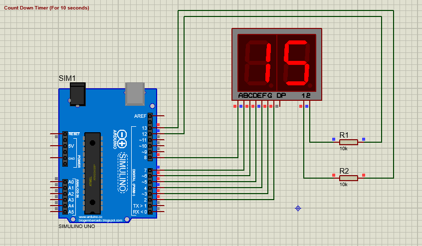

# 2digit-7segment-display_and_LCD
(1) Count down timer using 2 digit 7 segment display. (2) Animated text using LCD

### Count Down Timer:
proteus-soft-circuit: a) Arduino uno device 
                  b) 2-Digit 7-segment display device
                  c) Two registor (10k)

### Animated text using LCD:
proteus-soft-circuit: a) Arduino uno device 
                  b) LCD 
                  c) ground

